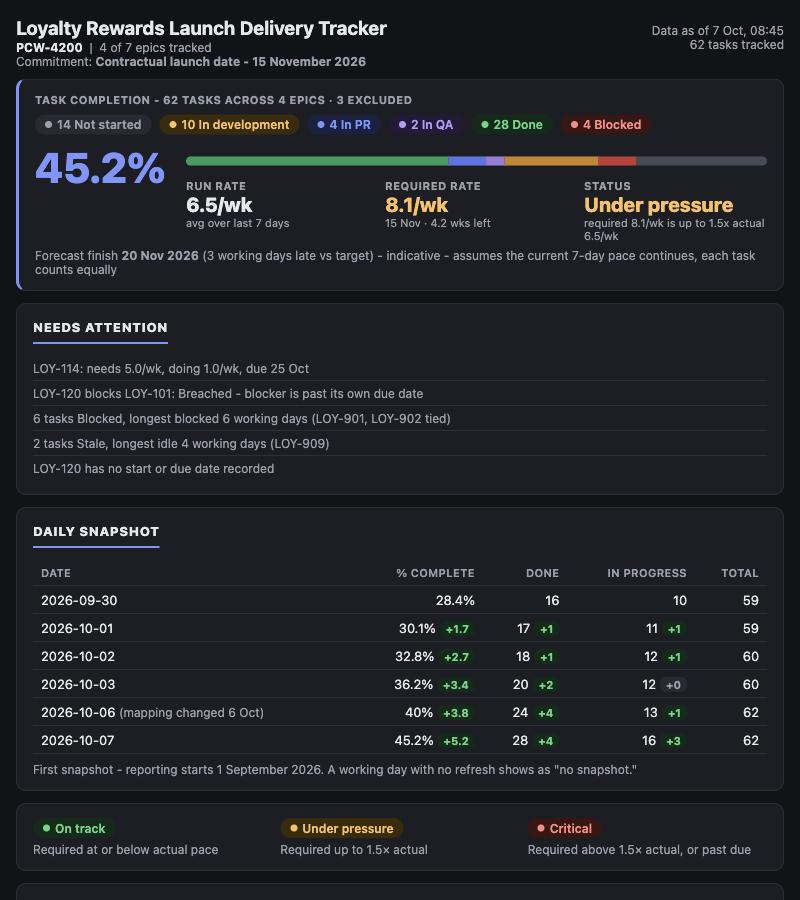
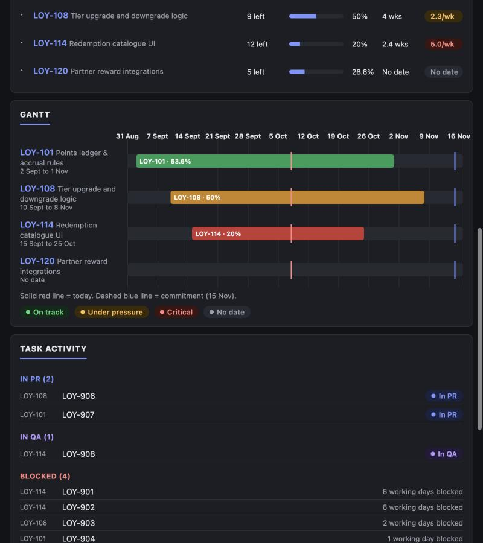
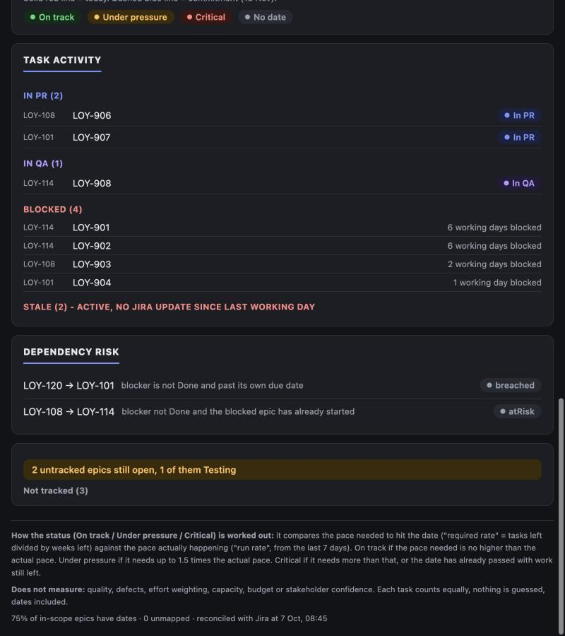

# PCW Tracker

A Claude Code / Cowork skill that builds a read-only delivery tracker for one PCW (Platform
Committed Work) from Jira, and keeps it current with a daily refresh. Built for Deltatre PMs
tracking delivery against `dicetech.atlassian.net`.

## What it looks like

Screenshots below are from [`docs/demo.html`](docs/demo.html) - a standalone page with entirely
fictional sample data (no real Jira content), so you can see the real layout without needing
Jira access or a claude.ai sign-in. Open it in any browser, or run it locally:

```bash
python3 -m http.server 8080 --directory docs   # then open http://localhost:8080/demo.html
```

**Headline**: the big number, status pills, pace against the commitment, and a plain-English
explanation next to the status, not just a colour.



**Epic run rates and Gantt**: each epic's own pace, and a timeline with a real date axis, a
today-line, and the commitment date.



**Task activity and dependency risk**: what's in PR or QA, what's blocked and for how long, and
real Jira issue links classified as clear, at risk, or breached.



## Install

```bash
git clone https://github.com/delta-deji/pcw-tracker.git ~/code/pcw-tracker
ln -s ~/code/pcw-tracker ~/.claude/skills/pcw-tracker
```

That's it - restart Claude Code (or start a new session) and both the trigger phrases ("Build the
PCW tracker for PCW-XXXX") and the `/pcw-tracker` slash command become available. This mirrors how
`deltatre-ai-tools` installs its own skills: a symlink, not a copy, so a later `git pull` in the
cloned folder updates what's installed without reinstalling anything.

**Prerequisites**: a Claude Code / Cowork session with the Atlassian MCP connector (for
`dicetech.atlassian.net`) and the Artifact/ArtifactData tools available - this skill publishes its
tracker as a claude.ai Artifact with a shared database, which is Claude-specific; it has no GitHub
Copilot equivalent.

**Staying current**: `cd ~/code/pcw-tracker && git pull` whenever you want the latest version -
no reinstall needed, same symlink. Each existing tracker records which skill version it was built
on (`config.skillVersionBuilt`); run `/pcw-tracker update PCW-XXXX` afterwards to rebuild an
existing tracker on the new version without re-asking any setup questions.

## 1. What it is, and who it's for

A PCW is a Jira Initiative that groups the epics for one piece of delivery - think of it as the
folder that holds everything belonging to one commitment, the way a project folder holds every
file for one piece of work. This skill reads that folder's contents in Jira, works out where
things stand, and publishes the result as a single page anyone you share it with can open. You
see exactly what they see, every time either of you reloads it - nobody is looking at a stale
copy or a different set of numbers.

It's for a PM (or anyone accountable for a PCW's delivery) who wants a shared source of truth
instead of manually chasing status across dozens of tickets, without that chasing turning into
yet another thing to maintain by hand.

## 2. What it measures, and what it doesn't

**Measures**: task-count progress, pace against deadlines and commitments, blockers, stale work,
dependencies between epics, and scope change over time.

**Does not measure**: quality or defects, effort weighting (a one-line fix and a three-week
rebuild both count as "one task"), capacity, budget, or stakeholder confidence. If you need any
of those, this isn't the tool - and the tracker says so on its own footer, so nobody mistakes a
green pill for "everything is fine."

## 3. How progress is counted

Every counted task is worth exactly 1, whether it's trivial or enormous - no story points, no
weighting. A task only counts as **Done** when its Jira status maps to Done; being in review or
in test earns no partial credit. The headline percentage is a pooled ratio (all Done tasks across
every tracked epic, divided by all counted tasks) - it is never an average of each epic's own
percentage, because that would let one small, fully-finished epic hide a much bigger one still at
0%.

**Excluded** tasks (typically "Won't do") leave the total entirely - they neither help nor hurt
the percentage, and are shown only as a small count so you know they exist. **Blocked** tasks stay
in the denominator (they're still owed), just flagged separately so they're easy to spot.

## 4. How to read the signals

Each epic (and the tracker as a whole) gets a plain-word status, never just a colour:

- **On track** - the pace still needed to hit the date is at or below the pace actually happening.
- **Under pressure** - the pace needed is up to 1.5 times the actual pace. Still achievable, worth
  a look.
- **Critical** - the pace needed is more than 1.5 times actual, or the date has already passed
  with work left.

Every status pill is shown with its numbers alongside it (e.g. "needs 12.9/wk, doing 2.0/wk") -
never a bare colour you have to take on faith.

**Forecast finish** projects today's pace forward to a likely finish date, labelled "indicative."
Early on, with only a few days of real activity behind a PCW, this number is deliberately hidden
behind a note instead of shown - a forecast built on two or three days of pace is more noise than
signal, and showing an alarming date before there's enough data to trust it does more harm than
good.

**Needs attention** is a short, rule-based list - never written prose, always a template filled
from the real numbers (e.g. "9 tasks Blocked, longest blocked 4 working days"). If nothing trips a
rule, it says so plainly rather than leaving the section looking broken.

**Dependencies** come only from real Jira issue links, never guessed from epic numbering. A link
is Clear (the blocker's done), At Risk, Breached (the blocker's overdue), or Unknown (not enough
dates to judge). "No dependency links recorded" is not the same claim as "no risk" - the tracker
is careful never to say the second when it only knows the first.

## 5. What refreshes, and when

Once a day (08:45 UK time by default, working days only), the tracker re-reads Jira and stores a
fresh snapshot - that's the only time the numbers change. Opening or reloading the page never
calls Jira itself; it just reads what was last stored, so two people looking at the same link at
the same moment always see identical numbers. The page shows "Data as of [date, time]" and warns
visibly if that's more than a working day old, in case a scheduled refresh was missed.

Only the owner (and an optional named co-owner) can trigger a refresh or change anything. Everyone
else the tracker is shared with is read-only, by design - the Share menu on the published page is
what actually grants that access, not this skill.

## 6. The first-time walkthrough

Building a tracker for a new PCW asks five things, pre-filled from Jira wherever possible so you
mostly just confirm or correct rather than compose from scratch:

1. **Scope** - which child epics are actually being delivered (Testing epics and abandoned ones
   are excluded by default, with a reason recorded for each).
2. **Status mapping** - which of the statuses your team actually uses count as Not started, In
   development, In PR, In QA, Done, or Blocked.
3. **Reporting start** - today, or a later date if you'd rather not backfill history that already
   happened.
4. **Commitment** - is there a contractual or non-negotiable date this is tracked against.
5. **Share and schedule** - who can view it, and what time the daily refresh runs.

Nothing is published, shared, or scheduled until you've seen a plain-language summary and
confirmed it.

## 7. Changing a tracker later

- **`/pcw-tracker refresh PCW-XXXX`** (or "Refresh the PCW-XXXX tracker") - the daily or on-demand
  pull from Jira. This is what the schedule runs automatically; it never touches your settings.
- **`/pcw-tracker scope PCW-XXXX`** (or "Change the scope on the PCW-XXXX tracker") - re-checks
  Jira for anything new (a new epic, a new status) and asks only about what's actually changed,
  not the whole walkthrough again. It's also the moment to revisit an earlier call - e.g. an epic
  excluded as "not real scope yet" that's since gained real dates and activity.
- **`/pcw-tracker update PCW-XXXX`** (or "Update the PCW-XXXX tracker") - rebuilds the page on the
  latest version of this skill, using your existing settings, without re-pulling Jira or asking
  anything new. Use this after the skill itself has been improved.
- **`/pcw-tracker build PCW-XXXX`** (or "Build the PCW tracker for PCW-XXXX") - the first-time
  setup, for a PCW that doesn't have a tracker yet.

A bare PCW key, or the word "tracker" on its own, won't trigger any of this - you always need a
key and one of the four actions above, by phrase or by slash command.
